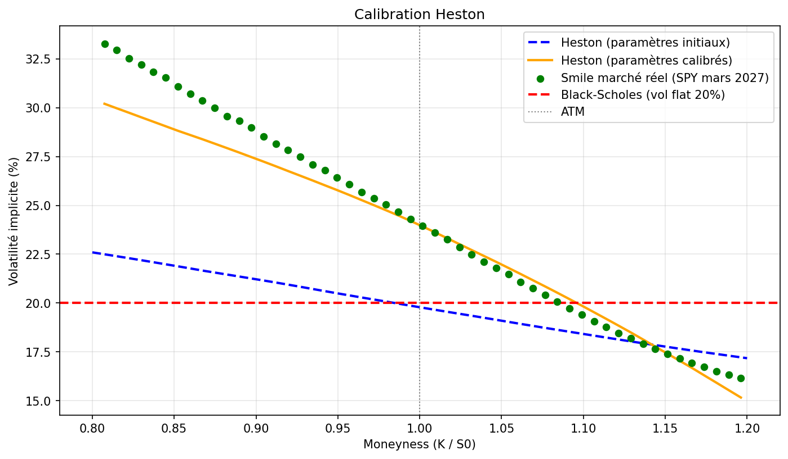

# Heston Stochastic Volatility Model — S&P500

## Objectif

Black-Scholes suppose une volatilité constante, ce qui est contredit par le marché réel.
Ce projet implémente et calibre le modèle de Heston pour modéliser une volatilité 
stochastique et reproduire le smile de volatilité observé sur les options SPY.

---

## Résultats



Après calibration sur options SPY mars 2027 :
- **Black-Scholes** échoue à reproduire le smile, vol plate à 20%
- **Heston initial** capture la structure mais est décalé avec des paramètres arbitraires
- **Heston calibré** colle au marché réel, notamment sur la zone ATM

---

## Le modèle de Heston

Heston modélise deux processus couplés :

**Prix du sous-jacent :**
dS = S·r·dt + S·√v·dW₁

**Variance stochastique :**
dv = κ(θ - v)dt + σᵥ·√v·dW₂

Avec dW₁ et dW₂ corrélés par ρ — le leverage effect.

---

## Paramètres calibrés sur le marché réel

| Paramètre | Initial | Calibré | Interprétation |
|-----------|---------|---------|----------------|
| κ (kappa) | 2.00 | 0.917 | Mean reversion lente — les périodes de forte vol durent |
| θ (theta) | 20% | 35.3% | Marché anticipe une vol long terme élevée |
| σᵥ (sigma_v) | 0.30 | 0.695 | Vol of vol élevée — marché agité |
| ρ (rho) | -0.70 | -0.990 | Leverage effect extrême — marché sous tension |
| V₀ | 20% | 21.5% | Vol actuelle cohérente avec le VIX |


---

## Étapes du projet

**1. Simulation Monte Carlo**
10 000 trajectoires via schéma d'Euler-Maruyama.
Full truncation scheme pour éviter les variances négatives.

**2. Pricing d'options européennes**
Call et put pricés par Monte Carlo.
Vérification par la parité call-put.

**3. Smile de volatilité**
Vol implicite calculée par inversion de BS (méthode de Brent).
Mise en évidence des limites de Black-Scholes.

**4. Calibration sur données réelles**
Récupération des options SPY via yfinance.
Minimisation de l'erreur quadratique moyenne par L-BFGS-B (scipy).
Paramètres calibrés reflétant l'état actuel du marché.

---

## Conclusions

- Heston reproduit naturellement le skew de volatilité grâce au leverage effect (ρ < 0)
- La calibration montre que le marché anticipe actuellement une vol long terme de 35% 
  et un leverage effect quasi maximal (ρ = -0.99) — signe de stress
- Black-Scholes est structurellement incapable de capturer ces dynamiques

---

## Limites

- Schéma d'Euler-Maruyama — biais numérique sur les ailes du smile
- Calibration Monte Carlo bruitée — une approche analytique (Fourier) serait plus précise
- Un seul modèle testé — SV Jump, SABR ou Variance Gamma iraient plus loin

---

## Librairies
```
numpy, matplotlib, scipy, yfinance
```

---

## Contexte

Projet personnel réalisé dans le cadre d'une démarche d'apprentissage
de la finance de marché et des modèles de volatilité stochastique.
