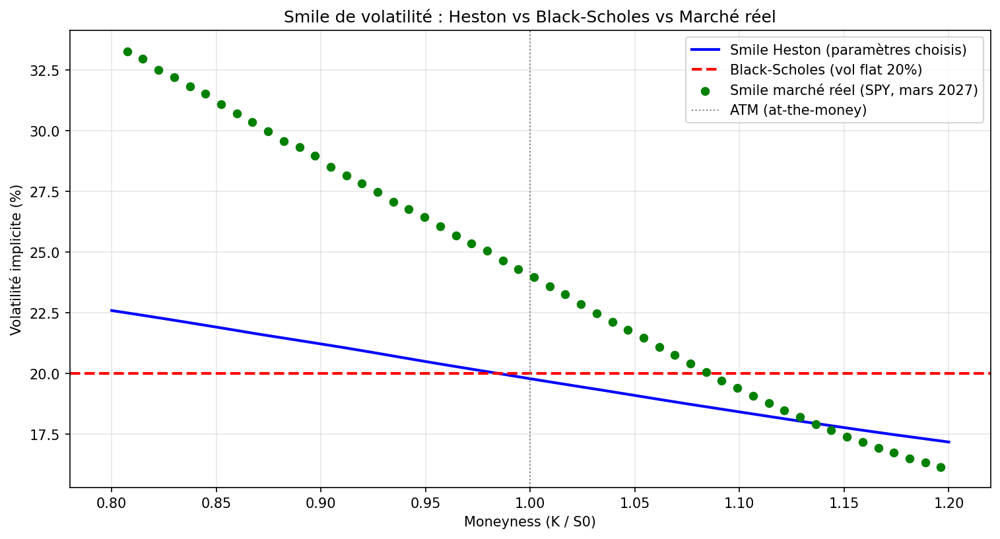

# Heston Stochastic Volatility Model — S&P500

## Objectif

Black-Scholes suppose une volatilité constante — ce qui est contredit par le marché réel.
Ce projet implémente le modèle de Heston pour modéliser une volatilité stochastique
et reproduire le smile de volatilité observé sur les options S&P500.

---

## Résultats



- **Black-Scholes** : volatilité plate à 20% — ne reproduit pas le smile
- **Heston** : skew asymétrique généré par le leverage effect (ρ = -0.7)
- **Marché réel** : smile SPY mars 2027 — Heston capture la structure mais nécessite une calibration

---

## Structure du projet
```
heston-stochastic-volatility-sp500/
│
├── heston_simulation.py   # Code principal
└── README.md
```

---

## Le modèle de Heston

Heston modélise deux processus couplés :

**Prix du sous-jacent :**
dS = S·r·dt + S·√v·dW₁

**Variance stochastique :**
dv = κ(θ - v)dt + σᵥ·√v·dW₂

Avec dW₁ et dW₂ corrélés par ρ.

### Paramètres utilisés

| Paramètre | Valeur | Signification |
|-----------|--------|---------------|
| κ (kappa) | 2.0 | Vitesse de mean reversion |
| θ (theta) | 0.04 | Variance long terme (vol 20%) |
| σᵥ (sigma_v) | 0.3 | Volatilité de la volatilité |
| ρ (rho) | -0.7 | Leverage effect |
| V₀ | 0.04 | Variance initiale |

---

## Étapes du projet

**1. Simulation Monte Carlo**
10 000 trajectoires via schéma d'Euler-Maruyama.
Full truncation scheme pour éviter les variances négatives.

**2. Pricing d'options européennes**
Call et put pricés par Monte Carlo.
Vérification par la parité call-put.

**3. Smile de volatilité Heston**
Vol implicite calculée par inversion de BS (méthode de Brent).
Comparaison avec la vol flat de Black-Scholes.

**4. Comparaison avec le marché réel**
Données options SPY récupérées via yfinance.
Mise en évidence de l'écart entre paramètres arbitraires et marché calibré.

---

## Limite et perspective

Les paramètres utilisés sont arbitraires — l'écart avec le marché réel
montre la nécessité d'une **calibration numérique** (minimisation scipy)
pour trouver les 5 paramètres qui minimisent l'erreur sur les prix d'options réels.

---

## Librairies
```
numpy
matplotlib
scipy
yfinance
```

---

## Contexte

Projet personnel réalisé dans le cadre d'une démarche d'apprentissage
de la finance de marché et des modèles de volatilité stochastique.
